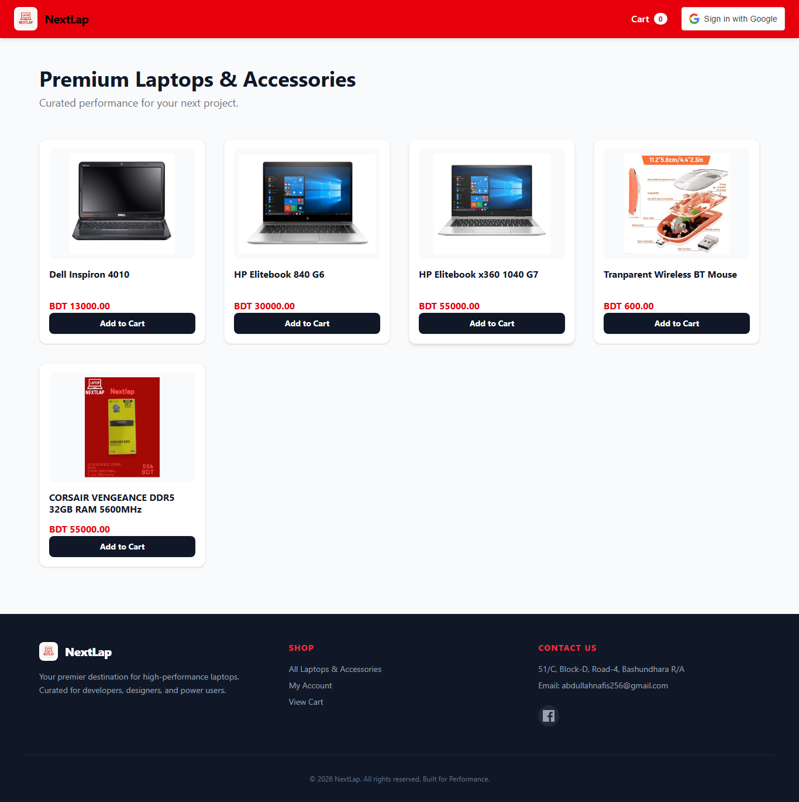
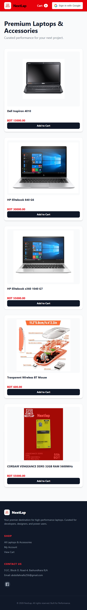

# 💻 NextLap | Full-Stack Electronics Marketplace

NextLap is a modern, high-performance e-commerce platform designed for high-end electronics. Originally built as a laptop store, it has evolved into a scalable marketplace supporting categories like gaming accessories and PC components.

Built with a decoupled architecture using **Django REST Framework** and **React (Vite)**, NextLap delivers a fast, secure, and responsive shopping experience.

---

## 🏗️ Architecture

NextLap follows a **decoupled (headless) architecture**:

- **Frontend (React)** → Handles UI, state, and user interactions  
- **Backend (Django REST API)** → Manages database, authentication, and business logic  
- Communication via secure REST APIs  

---

## 🌟 Features

### 🛒 Shopping Experience
- **Unified Product Engine**  
  Single product model supporting multiple categories (Laptops, Accessories, etc.)

- **Dynamic Image Gallery**  
  Multiple high-resolution images per product

- **Real-time Cart**  
  Persistent cart for authenticated users

---

### 🔐 Authentication & Security
- Google OAuth 2.0 Login  
- Token-based authentication (DRF TokenAuth)  
- Protected routes for user-specific actions  

---

### 🎨 UI/UX
- Fully responsive design (Mobile → 4K)  
- Skeleton loading states  
- Smooth error handling  

---

## 📸 Templates Screenshots

### 🏠 Home Page


### 📦 Product Page


## 🛠️ Tech Stack

| Layer       | Technology              | Purpose                          |
|------------|------------------------|----------------------------------|
| Frontend   | React 18 (Vite)        | Fast UI rendering               |
| Backend    | Django 5.x             | Business logic & ORM            |
| API        | Django REST Framework  | RESTful APIs                    |
| Styling    | Tailwind CSS           | Responsive UI design            |
| Auth       | Google OAuth           | Social login                    |
| Database   | SQLite / PostgreSQL    | Data storage                    |

---

## 📂 Project Structure
NextLap/
├── backend/
│ ├── nextlap/
│ ├── nextapp/
│ ├── media/
│ └── manage.py
│
└── frontend/
├── src/
│ ├── components/
│ ├── pages/
│ ├── api.js
│ └── App.jsx
└── tailwind.config.js
│
└── Template/

│ ├── T1-Desktop view
│ └── T2-Mobile view


---

## 🚀 Installation & Setup

### 1️⃣ Prerequisites

- Python 3.10+
- Node.js 18+
- Google OAuth Client ID

---

### 2️⃣ Backend Setup

```bash
cd backend

python -m venv venv

# Activate virtual environment
# Windows
venv\Scripts\activate

# Mac/Linux
source venv/bin/activate

pip install -r requirements.txt

python manage.py makemigrations
python manage.py migrate
python manage.py createsuperuser

python manage.py runserver
